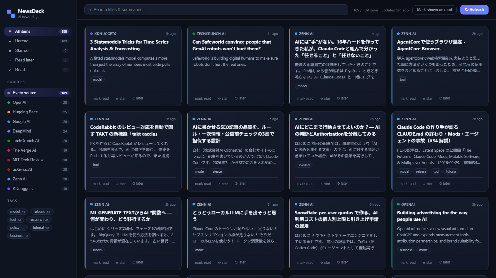

# NewsDeck — AI News Triage Board

A single-user web app for clearing your AI news inbox. A Node server fetches
ten curated RSS/Atom feeds, normalizes and deduplicates the items, auto-tags
them, and serves a card board where you filter, search, mark read, star, and
queue items for later.

Built with [Kiro](https://kiro.dev) for the **Kiro University Challenge** 2026
(#KiroUniversity #BuildWithKiro).



## Features

- **Board** — card grid with per-source accent badges, relative timestamps,
  tag chips, inline triage actions
- **Feeds** — OpenAI, Hugging Face, Google AI, DeepMind, TechCrunch AI,
  The Verge AI, MIT Tech Review, arXiv cs.AI, Zenn AI, KDnuggets
- **Auto-tags** — release / research / model / tutorial / business / policy /
  tool via configurable keyword rules (`shared/tagger.ts`)
- **Filters compose** — source + status + tag + free-text search
- **Triage state** — read / starred / read-later persisted in localStorage
- **Resilient** — snapshot cache on disk; a dead feed degrades to a warning,
  never takes the board down

## Quick start

Requires **Node 20+** (developed on 22) and npm. No other services or API keys.

```bash
npm install
npm run dev        # api :8787 + vite :5173 -> open http://localhost:5173
```

The repo ships a fresh snapshot (`server/data/snapshot.json`), so the board
renders real items immediately — even fully offline. `npm run snapshot`
re-fetches all feeds; `npm test` runs the vitest + fast-check property suite;
`npx tsx server/index.ts` runs the API alone; `node mcp-server/index.mjs`
starts the MCP stdio server.

## Kiro University Challenge — lesson map

| Lesson | Where it lives |
|---|---|
| L1 Spec-driven development | `.kiro/specs/news-triage/` — requirements → design → tasks (EARS) |
| L2 Steering documents | `.kiro/steering/` — TS/React style + project context |
| L3 Hooks | `.kiro/hooks/` — PostFileSave hooks in both CLI (`hooks.json`) and IDE (`*.kiro.hook`) formats: PBT suite, feed-registry validation, typecheck |
| L4 Property-based testing | `tests/` — 16 fast-check properties over `shared/` (dedupe idempotence, ordering, filter laws, tagger purity, normalize robustness); properties enumerated in `design.md` |
| L5 Powers | `.kiro/powers/newsdeck/` — plugin.json + 2 skills |
| L6 MCP | `.kiro/settings/mcp.json` — `newsdeck` (custom zero-dep stdio server in `mcp-server/`) + `fetch` |
| L7 Custom agents | `.kiro/agents/` — `newsdeck-dev` (implementation, spec+steering resources) and `news-scout` (read-only analyst, MCP-only). Verified via `kiro-cli agent list` |
| Bonus 2 — packaged power | `power-newsdeck/` — installable via Powers panel → Import power from GitHub |

## Layout

```
.kiro/        specs, steering, hooks, powers, agents, mcp.json
power-newsdeck/   distributable power (Bonus 2)
server/       Express API + feed fetcher + snapshot cache
mcp-server/   zero-dependency stdio MCP server over the snapshot
shared/       pure TS: normalize, dedupe, tagger, filters, types
src/          React SPA (sidebar, topbar, card grid)
tests/        vitest + fast-check property tests
```
